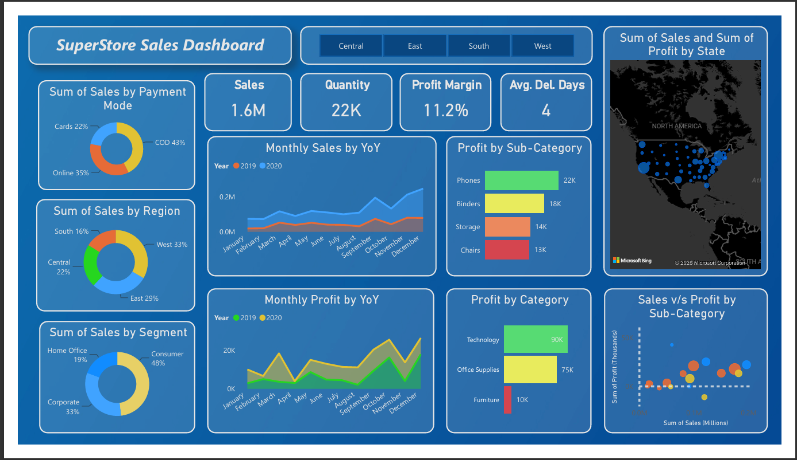
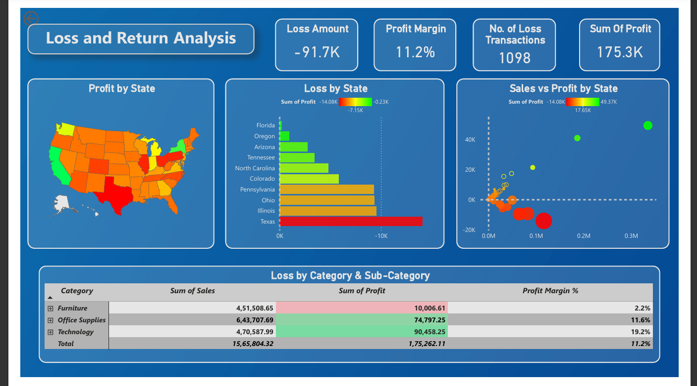
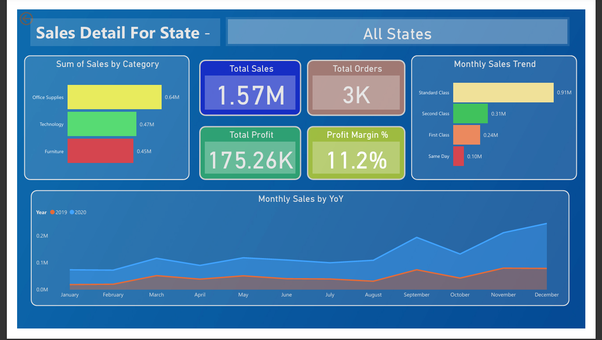
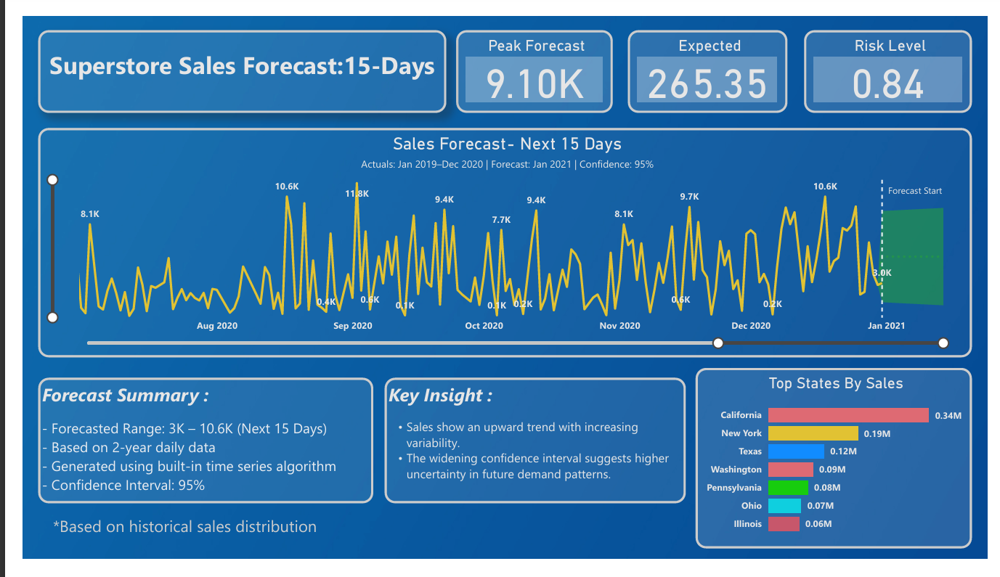

# SuperStore Sales Dashboard — Power BI

## 📌 Project Overview
A 4-page interactive Power BI dashboard analyzing 
SuperStore retail performance across 4 regions, 
3 product categories, and 49 US states using 
2 years of daily transaction data.

## 🔢 Key Metrics
| Metric | Value |
|--------|-------|
| Total Sales | $1.6M |
| Profit Margin | 11.2% |
| Total Quantity | 22K |
| Avg. Delivery Days | 4 |
| Loss Amount | -$91.7K |
| Loss Transactions | 1,098 |

## 📁 Dashboard Pages

### 1. Main Dashboard
- KPI cards: Sales, Quantity, Profit Margin, Avg Delivery Days
- YoY Monthly Sales and Profit trends (2019 vs 2020)
- Sales by Region, Segment, Payment Mode (donut charts)
- Profit by Category and Sub-Category
- Sales vs Profit scatter plot by Sub-Category
- Geographic map: Sales and Profit by State

### 2. Loss & Returns Analysis
- Loss Amount: -91.7K across 1,098 transactions
- Profit by State heatmap (red = loss, green = profit)
- Loss by State ranked bar chart (Texas: -14.08K)
- Sales vs Profit scatter plot by State
- Matrix: Category-level Sales, Profit, Margin %

### 3. State Detail Page
- Filterable by individual US state via slicer
- KPI cards: Total Sales, Profit, Margin %, Orders
- Sales by Category and Ship Mode breakdown
- Monthly Sales YoY trend line chart

### 4. 15-Day Sales Forecast
- Time series forecast: range 3K–10.6K
- 95% confidence interval with labelled forecast zone
- Peak Forecast: 9.10K | Risk Level: 0.84
- Forecast Summary and Key Insights documented
- Top States by Sales bar chart

## 💡 Key Insights
- Texas is highest loss-making state at -$14.08K profit
- Furniture has lowest margin (2.2%) despite $451K sales
- Technology leads profitability at 19.2% margin
- Sales show upward trend with Q4 seasonal spikes
- COD is dominant payment mode at 43%

## 🛠️ Tools & Skills
- Power BI Desktop
- DAX (Data Analysis Expressions)
- Time Series Analysis
- Excel (data source)
- Data Visualization & Storytelling

## 📸 Dashboard Preview

### Main Dashboard

### Loss & Returns Analysis

### State Detail

### Forecast Page

## 📂 Repository Files
| File | Description |
|------|-------------|
| `Sales Dashboard.pbix` | Power BI source file |
| `Sales Dashboard.pdf` | Full dashboard PDF |
| `01_Main_Dashboard.png` | Main page screenshot |
| `02_Loss_Analysis.png` | Loss analysis screenshot |
| `03_State_Detail.png` | State detail screenshot |
| `04_Forecast.png` | Forecast page screenshot |

## 📊 Dataset
SuperStore Sales Dataset — commonly used retail analytics dataset containing orders, customers, products and regional sales data for 2019-2020.
